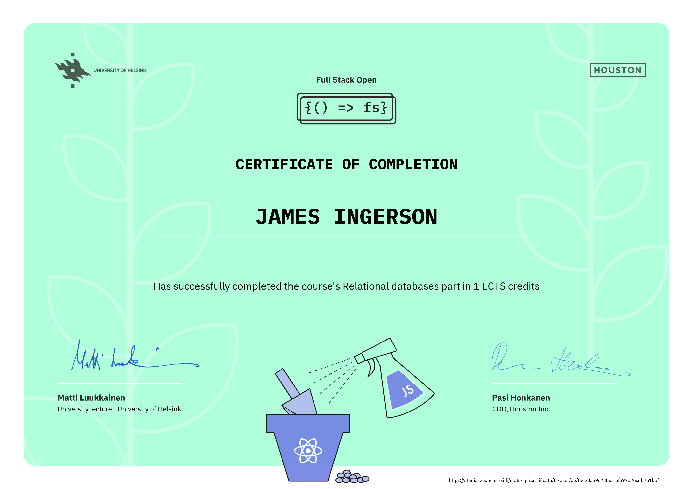

# [Full Stack Open 2022](https://fullstackopen.com/en/)

Learning React, Redux, Node.js, MongoDB, GraphQL, TypeScript, React Native, GitHub Actions, Docker, and PostgreSQL.

## [Part 13 - Using relational databases](https://fullstackopen.com/en/part13)

a. [Using relational databases with Sequelize](https://fullstackopen.com/en/part13/using_relational_databases_with_sequelize)  
b. [Join tables and queries](https://fullstackopen.com/en/part13/join_tables_and_queries)  
c. [Migrations, many-to-many relationships](https://fullstackopen.com/en/part13/migrations_many_to_many_relationships)  

## Module Certificate

  

